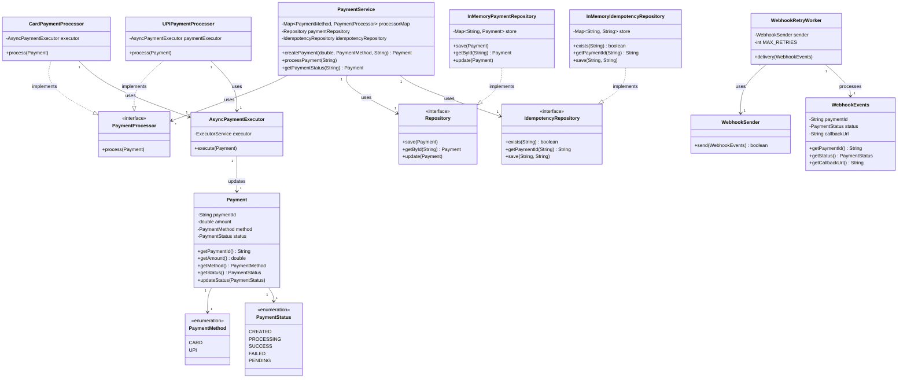
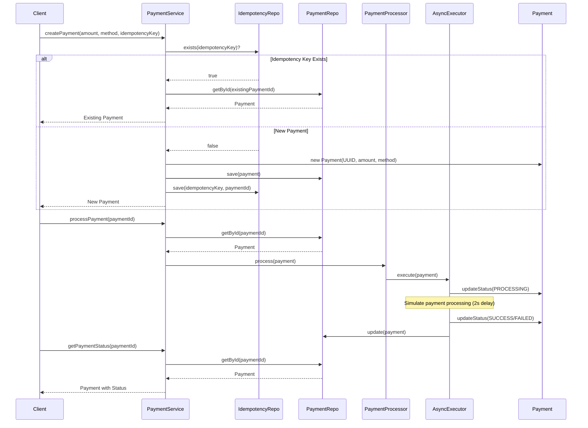

# Payment Gateway System

A robust, scalable payment gateway implementation in Java that supports multiple payment methods (Card and UPI) with asynchronous processing, idempotency handling, and webhook notifications.

## Table of Contents

- [Overview](#overview)
- [Architecture](#architecture)
- [UML Diagrams](#uml-diagrams)
- [Component Details](#component-details)
- [Getting Started](#getting-started)
- [How to Run](#how-to-run)
- [Project Structure](#project-structure)

## Overview

This payment gateway system provides a clean, extensible architecture for processing payments through different payment methods. It ensures:
- **Idempotency**: Prevents duplicate payments using idempotency keys
- **Asynchronous Processing**: Non-blocking payment processing for better performance
- **Extensibility**: Easy to add new payment methods through the Strategy pattern
- **Reliability**: Webhook system with retry mechanism for status notifications

## Architecture

The system follows a layered architecture with clear separation of concerns:

```
┌─────────────────────────────────────────────────────────────┐
│                    Application Layer (Main)                  │
│                    - Orchestrates components                 │
└────────────────────────┬────────────────────────────────────┘
                         │
                         ▼
┌─────────────────────────────────────────────────────────────┐
│                    Service Layer                             │
│                    PaymentService                            │
│                    - Business logic                          │
│                    - Idempotency handling                    │
└────────────┬────────────────────────────┬───────────────────┘
             │                            │
             ▼                            ▼
┌──────────────────────┐    ┌────────────────────────────────┐
│   Processor Layer    │    │      Repository Layer          │
│  PaymentProcessor    │    │  - PaymentRepository           │
│  - CardProcessor     │    │  - IdempotencyRepository       │
│  - UPIProcessor      │    └────────────────────────────────┘
└──────────┬───────────┘
           │
           ▼
┌─────────────────────────────────────────────────────────────┐
│              AsyncPaymentExecutor                           │
│              - Thread pool execution                        │
│              - Status updates                               │
└─────────────────────────────────────────────────────────────┘
```

## UML Diagrams

### Class Diagram



### Sequence Diagram - Payment Flow



## Component Details

### 1. Models (`models/Payment.java`)

**Purpose**: Represents the core payment entity with all payment-related information.

**Why**: Centralizes payment data and ensures immutability of payment identity (paymentId) while allowing status updates.

**How**: 
- Contains immutable fields: `paymentId`, `amount`, `method`
- Mutable `status` field that tracks payment lifecycle
- Provides controlled access through getters and `updateStatus()` method

**Key Features**:
- Immutable payment identity prevents accidental modification
- Status management through dedicated method ensures controlled state transitions

---

### 2. Enums

#### `PaymentMethod` (`enums/PaymentMethod.java`)
**Purpose**: Defines supported payment methods.

**Why**: Type-safe way to represent payment methods, preventing invalid values and enabling compile-time checks.

**Values**: `CARD`, `UPI`

#### `PaymentStatus` (`enums/PaymentStatus.java`)
**Purpose**: Tracks payment lifecycle states.

**Why**: Clear state machine representation ensuring consistent status tracking across the system.

**States**: `CREATED` → `PROCESSING` → `SUCCESS`/`FAILED`/`PENDING`

---

### 3. Service Layer (`service/PaymentService.java`)

**Purpose**: Orchestrates payment operations and implements business logic.

**Why**: Single entry point for payment operations, ensuring consistency and enforcing business rules (like idempotency).

**How**:
- **createPayment()**: Creates new payment with idempotency check. If the same idempotency key is used, returns existing payment.
- **processPayment()**: Routes payment to appropriate processor based on payment method.
- **getPaymentStatus()**: Retrieves current payment status from repository.

**Key Design Decisions**:
- **Idempotency Check**: Prevents duplicate payments when clients retry requests
- **Strategy Pattern**: Uses processor map to delegate payment processing
- **Repository Abstraction**: Depends on interfaces, enabling easy swapping of storage implementations

---

### 4. Processor Layer

#### `PaymentProcessor` Interface (`processor/PaymentProcessor.java`)
**Purpose**: Contract for payment processing strategies.

**Why**: Strategy pattern enables adding new payment methods without modifying existing code (Open/Closed Principle).

#### `CardPaymentProcessor` (`processor/CardPaymentProcessor.java`)
**Purpose**: Processes card payments asynchronously.

**Why**: Different payment methods have different processing requirements. Card payments may need different logic than UPI.

**How**: Delegates actual processing to `AsyncPaymentExecutor` to avoid blocking the main thread.

#### `UPIPaymentProcessor` (`processor/UPIPaymentProcessor.java`)
**Purpose**: Processes UPI payments asynchronously.

**Why**: UPI payments have different validation rules and processing flow compared to card payments.

**How**: Similar to card processor but can be extended with UPI-specific validations and business logic.

**Design Pattern**: Strategy Pattern - allows runtime selection of payment processing algorithm.

---

### 5. AsyncPaymentExecutor (`processor/AsyncPaymentExecutor.java`)

**Purpose**: Executes payment processing asynchronously using a thread pool.

**Why**: 
- **Performance**: Non-blocking execution allows handling multiple payments concurrently
- **Scalability**: Thread pool manages resource utilization efficiently
- **User Experience**: Client doesn't wait for long-running payment processing

**How**:
- Uses `ExecutorService` with fixed thread pool (5 threads)
- Simulates payment processing with 2-second delay
- Randomly sets success/failure status for demonstration
- Updates payment status atomically within the async task

**Key Features**:
- Thread-safe payment status updates
- Exception handling with fallback to `PENDING` status
- Configurable thread pool size based on load requirements

---

### 6. Repository Layer

#### `Repository` Interface (`repository/Repository.java`)
**Purpose**: Abstraction for payment data persistence.

**Why**: Repository pattern decouples business logic from storage implementation, enabling easy database migration.

#### `InMemoryPaymentRepository` (`repository/InMemoryPaymentRepository.java`)
**Purpose**: In-memory storage for payments using ConcurrentHashMap.

**Why**: 
- **Simplicity**: No external dependencies for development/testing
- **Thread-Safety**: ConcurrentHashMap ensures safe concurrent access
- **Performance**: Fast in-memory lookups for demo/prototyping

**How**: Uses `ConcurrentHashMap<String, Payment>` to store payments keyed by paymentId.

**Note**: In production, replace with database-backed implementation (e.g., JPA, MongoDB).

#### `IdempotencyRepository` Interface (`repository/IdempotencyRepository.java`)
**Purpose**: Stores idempotency key to payment ID mappings.

**Why**: Separate concern from payment storage, enables different caching strategies for idempotency keys.

#### `InMemoryIdempotencyRepository` (`repository/InMemoryIdempotencyRepository.java`)
**Purpose**: In-memory storage for idempotency mappings.

**Why**: Fast lookups for idempotency checks. In production, consider Redis for distributed systems.

**How**: Maps idempotency keys to payment IDs using `ConcurrentHashMap`.

---

### 7. Webhook System

#### `WebhookEvents` (`webhooks/WebhookEvents.java`)
**Purpose**: Represents webhook notification payload.

**Why**: Immutable data transfer object ensures webhook payload integrity.

**Contains**: paymentId, status, callbackUrl

#### `WebhookSender` (`webhooks/WebhookSender.java`)
**Purpose**: Sends webhook notifications to merchant callback URLs.

**Why**: Decouples webhook delivery from payment processing logic.

**How**: Currently simulates webhook sending with random success/failure. In production, would make HTTP POST requests.

#### `WebhookRetryWorker` (`webhooks/WebhookRetryWorker.java`)
**Purpose**: Handles webhook delivery with automatic retry on failure.

**Why**: 
- **Reliability**: Network failures shouldn't cause notification loss
- **Resilience**: Retry mechanism ensures eventual delivery

**How**:
- Attempts up to 3 retries
- 5-second delay between retries
- Logs delivery status

**Improvement Opportunity**: In production, implement exponential backoff and persistent retry queue.

---

## Getting Started

### Prerequisites

- **Java Development Kit (JDK)**: Version 11 or higher
- **Java IDE**: IntelliJ IDEA, Eclipse, or VS Code with Java extensions
- **Maven or Gradle** (optional, if using build tools)

### Verify Java Installation

```bash
java -version
javac -version
```

Both commands should display Java version 11 or higher.

---

## How to Run

### Option 1: Using IDE (Recommended)

1. **Open the Project**
   - Open the project folder in your IDE (IntelliJ IDEA, Eclipse, or VS Code)

2. **Configure Java SDK**
   - Ensure project is configured to use JDK 11 or higher
   - In IntelliJ: `File` → `Project Structure` → `Project` → Set SDK

3. **Run Main Class**
   - Navigate to `src/Main.java`
   - Right-click on the file or the `main()` method
   - Select `Run 'Main.main()'` or press `Shift + F10` (IntelliJ) / `Ctrl + F11` (Eclipse)

4. **View Output**
   - Check console for output:
     ```
     Payment Created: <payment-id>
     Submitting Card payment async
     Final Status: PROCESSING (or SUCCESS/FAILED)
     ```

### Option 2: Using Command Line (javac + java)

1. **Open Terminal/Command Prompt**
   - Navigate to project root directory:
     ```bash
     cd C:\Users\Omkar\Desktop\LLD\payment-gateway
     ```

2. **Compile All Java Files**
   ```bash
   javac -d bin -sourcepath src src/**/*.java
   ```
   
   **Windows PowerShell**:
   ```powershell
   Get-ChildItem -Path src -Recurse -Filter *.java | ForEach-Object { javac -d bin -sourcepath src $_.FullName }
   ```
   
   **Windows CMD**:
   ```cmd
   for /r src %%f in (*.java) do javac -d bin -sourcepath src "%%f"
   ```

3. **Run the Application**
   ```bash
   java -cp bin Main
   ```

4. **Alternative: Compile and Run in One Step**
   ```bash
   javac -d bin src/Main.java src/**/*.java && java -cp bin Main
   ```

### Option 3: Using Scripts

#### Windows (run.bat)
Create `run.bat` in project root:
```batch
@echo off
javac -d bin -sourcepath src src\Main.java
if %errorlevel% neq 0 exit /b %errorlevel%
java -cp bin Main
pause
```

Run:
```cmd
run.bat
```

#### Unix/Mac/Linux (run.sh)
Create `run.sh` in project root:
```bash
#!/bin/bash
javac -d bin -sourcepath src src/**/*.java
if [ $? -eq 0 ]; then
    java -cp bin Main
fi
```

Make executable and run:
```bash
chmod +x run.sh
./run.sh
```

### Expected Output

```
Payment Created: <unique-uuid>
Submitting Card payment async
Final Status: PROCESSING
```

**Note**: Since payment processing is asynchronous, the final status might show `PROCESSING`. To see the final status, add a delay or poll the status:

```java
Thread.sleep(3000); // Wait 3 seconds
Payment finalPayment = paymentService.getPaymentStatus(payment.getPaymentId());
System.out.println("Final Status: " + finalPayment.getStatus());
```

---

## Project Structure

```
payment-gateway/
├── src/
│   ├── Main.java                          # Application entry point
│   ├── enums/
│   │   ├── PaymentMethod.java             # Payment method enumeration
│   │   └── PaymentStatus.java             # Payment status enumeration
│   ├── models/
│   │   └── Payment.java                   # Payment entity model
│   ├── service/
│   │   └── PaymentService.java            # Business logic orchestration
│   ├── processor/
│   │   ├── PaymentProcessor.java          # Processor interface (Strategy)
│   │   ├── CardPaymentProcessor.java      # Card payment implementation
│   │   ├── UPIPaymentProcessor.java       # UPI payment implementation
│   │   └── AsyncPaymentExecutor.java      # Async execution with thread pool
│   ├── repository/
│   │   ├── Repository.java                # Payment repository interface
│   │   ├── InMemoryPaymentRepository.java # In-memory payment storage
│   │   ├── IdempotencyRepository.java     # Idempotency repository interface
│   │   └── InMemoryIdempotencyRepository.java # In-memory idempotency storage
│   └── webhooks/
│       ├── WebhookEvents.java             # Webhook event model
│       ├── WebhookSender.java             # Webhook delivery
│       └── WebhookRetryWorker.java        # Webhook retry mechanism
└── README.md                              # This file
```

---

## Design Patterns Used

1. **Strategy Pattern**: `PaymentProcessor` interface allows runtime selection of payment method
2. **Repository Pattern**: Abstraction over data storage layer
3. **Factory Pattern**: Implicit in processor map creation
4. **Thread Pool Pattern**: AsyncPaymentExecutor manages concurrent payment processing

## Future Enhancements

- [ ] Database persistence (replace in-memory repositories)
- [ ] REST API layer (Spring Boot or JAX-RS)
- [ ] Distributed idempotency (Redis)
- [ ] Message queue for webhook delivery
- [ ] Payment gateway integrations (Stripe, Razorpay, etc.)
- [ ] Comprehensive unit and integration tests
- [ ] Transaction management and rollback mechanisms
- [ ] Audit logging
- [ ] Configuration management
- [ ] Rate limiting and throttling

---

## Contributing

This is a learning/demonstration project. Feel free to extend it with additional payment methods or features!

## License

This project is for educational purposes.